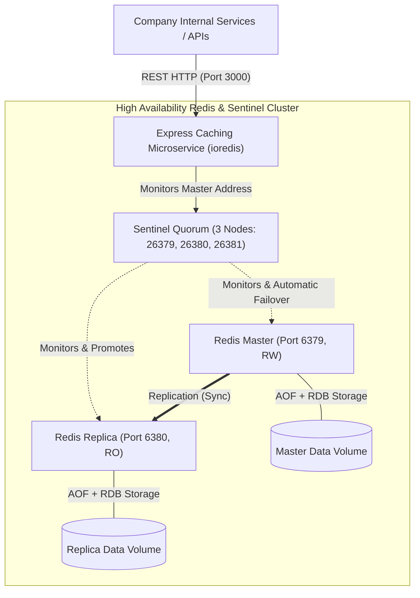

# Micro-Redis: High-Availability On-Premises Caching Microservice

A production-ready, self-hosted Caching Microservice REST API built with **Node.js 22 LTS**, **Express**, and **ioredis**. Designed as a centralized caching layer for internal company services with **zero cloud dependencies**, **full data persistence (AOF + RDB)**, and **automatic failover via Redis Sentinel**.

---

## 🏛️ Architecture Overview



### Key Reliability Pillars
* **High Availability (Sentinel):** 3-node Sentinel quorum monitors the primary Redis master. If the master drops, Sentinel automatically promotes the replica within seconds.
* **Smart Failover Handling (`ioredis`):** Intercepts `READONLY` replica exceptions and immediately queries Sentinel to rediscover the newly elected master without dropping requests or crashing the service.
* **Dual Persistence:** Configured with both **AOF (`appendfsync everysec`)** for minimal data loss and **RDB snapshots** for rapid recovery during server restarts.
* **Non-Blocking Invalidation:** Cache purging uses cursor-based `SCAN` streams and asynchronous `UNLINK` to reclaim memory without blocking the Redis event loop.

---

## 📂 Project Directory Structure

```
micro-redis/
├── docker/
│   ├── redis/
│   │   └── redis.conf              # Redis config (AOF + RDB persistence, LRU eviction)
│   └── sentinel/
│       └── sentinel.conf           # Sentinel config (quorum=2, down-after=3000ms)
├── src/
│   ├── app.js                      # Express application setup & middleware chain
│   ├── server.js                   # Server entry point & graceful shutdown listeners
│   ├── config/
│   │   ├── env.js                  # Environment configuration parser & validator
│   │   └── redis.js                # ioredis client factory (Sentinel / Standalone / Reconnect)
│   ├── controllers/
│   │   ├── cache.controller.js     # Key-value, increment, purge, delete controllers
│   │   ├── dataStructures.controller.js # Lists, Sets, Sorted Sets, Streams controllers
│   │   └── system.controller.js    # Health check and metrics controllers
│   ├── middleware/
│   │   ├── errorHandler.js         # Centralized error handler & Redis drop recovery
│   │   ├── requestLogger.js        # HTTP access logging (morgan)
│   │   └── validator.js            # Request body schemas (Zod)
│   ├── routes/
│   │   ├── cache.routes.js         # REST endpoints for cache & data structures
│   │   └── index.js                # API route aggregator
│   ├── services/
│   │   ├── cache.service.js        # Core cache logic & transparent JSON serialization
│   │   ├── dataStructures.service.js # Advanced Redis structures logic
│   │   └── metrics.service.js      # App hit/miss tracker & Redis INFO parser
│   └── utils/
│       ├── logger.js               # Structured logger
│       └── response.js             # Standardized JSON response envelope
├── tests/
│   └── cache.test.js               # Comprehensive automated integration test suite
├── api-requests.http               # VS Code REST Client test collection
├── postman_collection.json         # Postman collection export
├── Dockerfile                      # Production Node.js 22 LTS Alpine image
├── docker-compose.yml              # Production High-Availability Sentinel stack
├── docker-compose.standalone.yml   # Single-instance deployment for simple setups
├── package.json
└── README.md
```

---

## 🚀 Quick Start with Docker Compose

### Option A: High Availability Sentinel Cluster (Recommended for Production)

Starts **1 Master + 1 Replica + 3 Sentinels + Express App**:

```bash
# Build and start all services in the background
docker compose up -d --build

# Verify all containers are running and healthy
docker compose ps
```

### Option B: Standalone Mode (Lightweight single-instance)

Starts **1 Redis Instance (with AOF/RDB) + Express App**:

```bash
docker compose -f docker-compose.standalone.yml up -d --build
```

### Option C: Run Locally (Bare-metal Node.js)

1. Ensure Redis is running on `localhost:6379`.
2. Configure `.env`:
   ```bash
   cp .env.example .env
   ```
3. Install dependencies and start:
   ```bash
   npm install
   npm run dev
   ```

---

## ⚙️ Environment Variables Reference

| Variable | Default | Description |
| :--- | :--- | :--- |
| `PORT` | `3000` | Port Express listens on |
| `NODE_ENV` | `development` | Environment mode (`development` or `production`) |
| `REDIS_MODE` | `standalone` | Connection mode: `standalone` or `sentinel` |
| `REDIS_HOST` | `127.0.0.1` | Redis host (standalone mode) |
| `REDIS_PORT` | `6379` | Redis port (standalone mode) |
| `REDIS_PASSWORD` | *(empty)* | Optional Redis AUTH password |
| `REDIS_DB` | `0` | Redis logical DB index (0-15) |
| `REDIS_SENTINEL_MASTER_NAME` | `mymaster` | Master name monitored by Sentinel |
| `REDIS_SENTINEL_NODES` | `127.0.0.1:26379` | Comma-separated Sentinel nodes `host:port` |
| `REDIS_CONNECT_TIMEOUT` | `10000` | Connection timeout in milliseconds |
| `DEFAULT_TTL` | `3600` | Default cache expiration in seconds |

---

## 📡 API Reference & cURL Examples

Base URL: `http://localhost:3000/api/cache`

### 1. Health Check
Verifies connectivity to Redis, checks latency, and determines current role (`master` / `slave`).

```bash
curl -X GET http://localhost:3000/api/cache/health
```

**Response (200 OK):**
```json
{
  "success": true,
  "message": "Service and Redis are healthy",
  "data": {
    "status": "healthy",
    "mode": "sentinel",
    "latencyMs": 2,
    "role": "master",
    "redisVersion": "7.4.2",
    "uptimeSeconds": 1420,
    "usedMemory": "1.15M",
    "timestamp": "2026-09-30T08:45:00.000Z"
  }
}
```

---

### 2. Service & Redis Metrics
Tracks application hit/miss counts, hit ratio percentage, operations per second, memory usage, and connected clients.

```bash
curl -X GET http://localhost:3000/api/cache/metrics
```

**Response (200 OK):**
```json
{
  "success": true,
  "message": "Metrics retrieved successfully",
  "data": {
    "application": {
      "uptimeSeconds": 360,
      "totalRequests": 128,
      "hits": 112,
      "misses": 16,
      "sets": 45,
      "deletes": 5,
      "purges": 2,
      "increments": 24,
      "hitRatioPercentage": 87.5
    },
    "redis": {
      "version": "7.4.2",
      "role": "master",
      "connectedClients": 4,
      "usedMemory": "1.18M",
      "usedMemoryPeak": "1.25M",
      "totalCommandsProcessed": 5320,
      "opsPerSec": 15,
      "keyspaceHits": 112,
      "keyspaceMisses": 16,
      "keyspaceHitRatioPercentage": 87.5
    }
  }
}
```

---

### 3. Set Cache Key (`POST /api/cache`)
Supports storing `string` (JSON objects are automatically serialized) or `hash` structures with optional TTL (in seconds).

#### Store String with TTL:
```bash
curl -X POST http://localhost:3000/api/cache \
  -H "Content-Type: application/json" \
  -d '{
    "key": "user:session:1001",
    "value": {
      "userId": 1001,
      "username": "johndoe",
      "roles": ["admin", "developer"]
    },
    "ttl": 3600,
    "type": "string"
  }'
```

#### Store Hash Structure:
```bash
curl -X POST http://localhost:3000/api/cache \
  -H "Content-Type: application/json" \
  -d '{
    "key": "user:profile:1001",
    "value": {
      "fullName": "John Doe",
      "department": "Engineering",
      "country": "US"
    },
    "ttl": 7200,
    "type": "hash"
  }'
```

---

### 4. Get Cache by Key (`GET /api/cache/{key}`)
Automatically detects Redis data type (string, hash, list, set, zset, stream) and parses JSON data transparently.

```bash
curl -X GET http://localhost:3000/api/cache/user:session:1001
```

**Response (200 OK):**
```json
{
  "success": true,
  "message": "Cache retrieved successfully",
  "data": {
    "key": "user:session:1001",
    "type": "string",
    "value": {
      "userId": 1001,
      "username": "johndoe",
      "roles": ["admin", "developer"]
    },
    "ttl": 3582
  }
}
```

---

### 5. Atomic Counter / Rate Limiting (`POST /api/cache/increment`)
Performs atomic `INCRBY` / `INCRBYFLOAT` operations with optional TTL initialization.

```bash
curl -X POST http://localhost:3000/api/cache/increment \
  -H "Content-Type: application/json" \
  -d '{
    "key": "ratelimit:ip:192.168.1.100",
    "amount": 1,
    "ttl": 60
  }'
```

**Response (200 OK):**
```json
{
  "success": true,
  "message": "Cache key 'ratelimit:ip:192.168.1.100' incremented successfully",
  "data": {
    "key": "ratelimit:ip:192.168.1.100",
    "value": 1,
    "ttl": 60
  }
}
```

---

### 6. Purge Keys by Pattern (`POST /api/cache/purge`)
Purges all keys matching a prefix or pattern safely using `SCAN` cursor stream and `UNLINK`.

```bash
curl -X POST http://localhost:3000/api/cache/purge \
  -H "Content-Type: application/json" \
  -d '{
    "pattern": "user:*"
  }'
```

**Response (200 OK):**
```json
{
  "success": true,
  "message": "Cache purged successfully for pattern 'user:*'",
  "data": {
    "pattern": "user:*",
    "purgedCount": 15
  }
}
```

---

### 7. Explicit Delete Key (`DELETE /api/cache/{key}`)

```bash
curl -X DELETE http://localhost:3000/api/cache/user:session:1001
```

---

### 8. Rich Data Structures Endpoints

#### Lists (Queues / Job Stacks):
* **Push:**
  ```bash
  curl -X POST http://localhost:3000/api/cache/list/push \
    -H "Content-Type: application/json" \
    -d '{ "key": "queue:jobs", "values": [{"task": "send_welcome_email", "to": "user@example.com"}], "direction": "right" }'
  ```
* **Range:**
  ```bash
  curl -X GET "http://localhost:3000/api/cache/list/queue:jobs?start=0&stop=-1"
  ```
* **Pop:**
  ```bash
  curl -X POST http://localhost:3000/api/cache/list/pop \
    -H "Content-Type: application/json" \
    -d '{ "key": "queue:jobs", "direction": "left" }'
  ```

#### Sets (Unique Tags / Deduplication):
* **Add:**
  ```bash
  curl -X POST http://localhost:3000/api/cache/set/add \
    -H "Content-Type: application/json" \
    -d '{ "key": "tags:post:99", "members": ["redis", "ha", "sentinel"] }'
  ```
* **Members:**
  ```bash
  curl -X GET http://localhost:3000/api/cache/set/tags:post:99
  ```
* **Check Membership:**
  ```bash
  curl -X POST http://localhost:3000/api/cache/set/ismember \
    -H "Content-Type: application/json" \
    -d '{ "key": "tags:post:99", "member": "sentinel" }'
  ```

#### Sorted Sets (Leaderboards / Ranking):
* **Add:**
  ```bash
  curl -X POST http://localhost:3000/api/cache/zset/add \
    -H "Content-Type: application/json" \
    -d '{ "key": "leaderboard:weekly", "entries": [{"member": "Alice", "score": 980}, {"member": "Bob", "score": 1250}] }'
  ```
* **Range (Ordered Top to Bottom):**
  ```bash
  curl -X GET "http://localhost:3000/api/cache/zset/leaderboard:weekly?reverse=true&start=0&stop=-1"
  ```

#### Streams (Event Log / Message Streaming):
* **Add Stream Event:**
  ```bash
  curl -X POST http://localhost:3000/api/cache/stream/add \
    -H "Content-Type: application/json" \
    -d '{ "key": "events:system", "data": {"event": "SERVICE_START", "nodeId": "app-01"} }'
  ```
* **Read Stream:**
  ```bash
  curl -X GET "http://localhost:3000/api/cache/stream/events:system?count=20"
  ```

---

## 🧪 Testing Automatic Failover

To test the high-availability failover mechanism:

1. **Verify initial master:**
   ```bash
   curl http://localhost:3000/api/cache/health
   # Returns role: "master" connected to redis-master
   ```
2. **Stop the master container to simulate a hardware / server crash:**
   ```bash
   docker stop redis-master
   ```
3. **Monitor Sentinel logs:**
   ```bash
   docker compose logs -f sentinel-1
   # You will see:
   # +sdown master mymaster ...
   # +odown master mymaster ...
   # +failover-triggered
   # +promoted-slave redis-replica
   # +switch-master mymaster redis-master 6379 redis-replica 6379
   ```
4. **Query the health check again:**
   ```bash
   curl http://localhost:3000/api/cache/health
   # The Express microservice remains online, ioredis re-points to the new master!
   ```
5. **Recover the old master:**
   ```bash
   docker start redis-master
   # Sentinel automatically reconfigures redis-master to replicate the new master.
   ```

---

## 📊 Running Automated Tests

Run the integration test suite:

```bash
# If running standalone Redis
npm test
```

Tests validate:
- Health check & Redis connectivity
- String key-value with TTL & JSON serialization
- Hash object storage
- Atomic increment & TTL enforcement
- Pattern purging using non-blocking SCAN & UNLINK
- Lists, Sets, Sorted Sets, and Streams operations
- Input validation (Zod)
- Metrics aggregation
